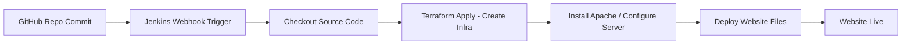
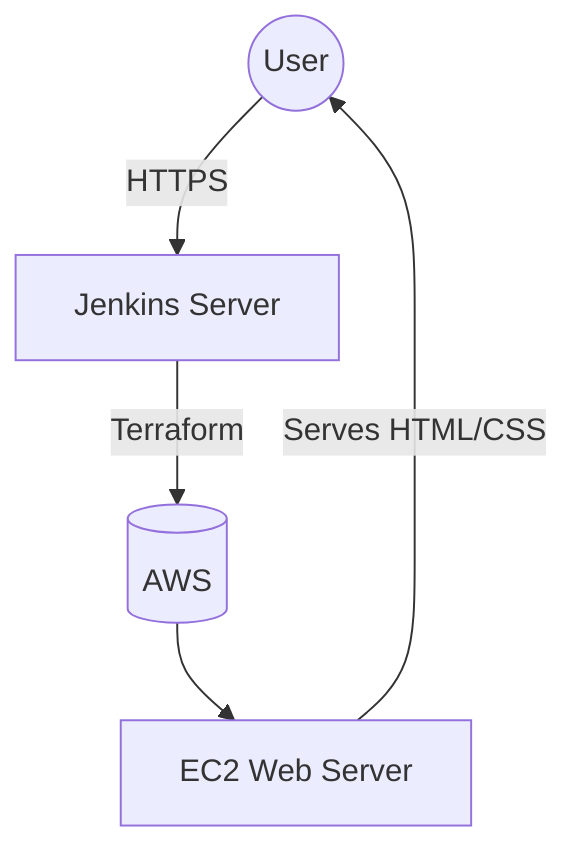

#  Static Website Deployment using Terraform & Jenkins

A fully automated **CI/CD pipeline** to deploy a static website on an EC2 server using **Terraform for infrastructure provisioning** and **Jenkins for automation**.

This project demonstrates how infrastructure and code work together seamlessly to deploy a static website in a cloud environment.

---

##  Project Overview

This project provisions an EC2 Ubuntu instance using Terraform and then deploys a static website using a Jenkins CI/CD pipeline. Any change pushed to the GitHub repository triggers the pipeline automatically.

---

##  Tools & Technologies Used

| Category               | Tools         |
| ---------------------- | ------------- |
| Cloud Provider         | AWS           |
| Infrastructure as Code | Terraform     |
| Automation             | Jenkins CI/CD |
| Programming/Markup     | HTML, CSS     |
| Server                 | Apache2/Nginx |
| Version Control        | GitHub        |

---

##  CI/CD Workflow



---

##  Architecture Diagram



---

##  Steps to Run the Project

### 1️⃣ Clone the Repository

```bash
git clone <repo-url>
cd Terraform-Jenkins-Static-Website
```

### 2️⃣ Configure AWS Credentials

```bash
aws configure
```

### 3️⃣ Initialize Terraform

```bash
terraform init
```

### 4️⃣ Apply Terraform to Create Infrastructure

```bash
terraform apply -auto-approve
```

> This creates the EC2 instance.

### 5️⃣ Jenkins Pipeline Execution

* Jenkins fetches the code
* Installs required server packages
* Deploys website files to EC2

### 6️⃣ Access the Website

Open the EC2 public IP in a browser:

```
http://<EC2-Public-IP>
```

---

##  Features

 Fully Automated Deployment
 Infrastructure as Code
 No Manual Server Setup
 Auto Trigger on GitHub Push

---

##  Future Enhancements

🔹 Add CloudFront CDN
🔹 S3 Static Hosting
🔹 SSL/HTTPS using ACM & Load Balancer
🔹 Monitoring with CloudWatch

---

##  Author

 **Aishwarya Pawar**

---

###  If you like this project, don't forget to Star the repo!
